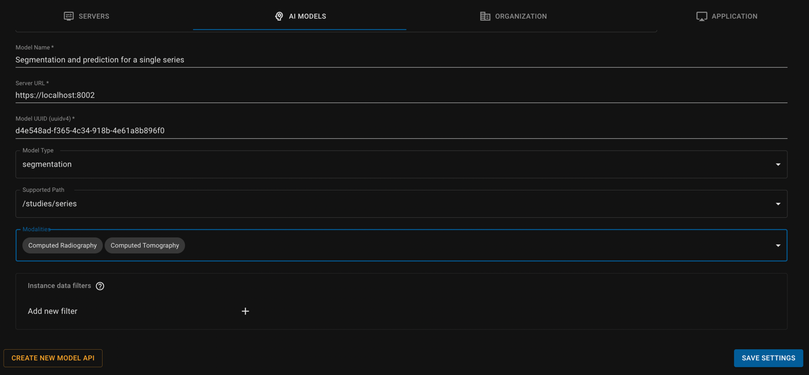
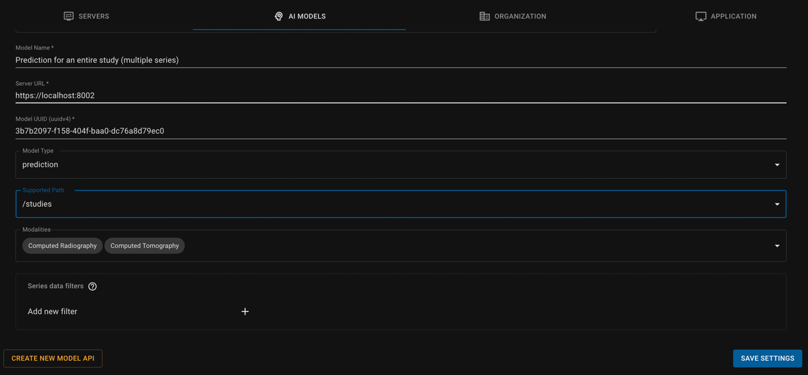
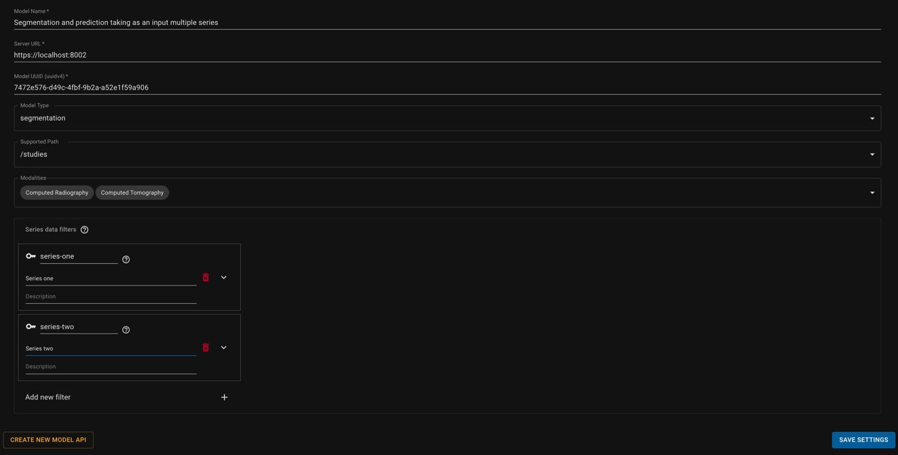
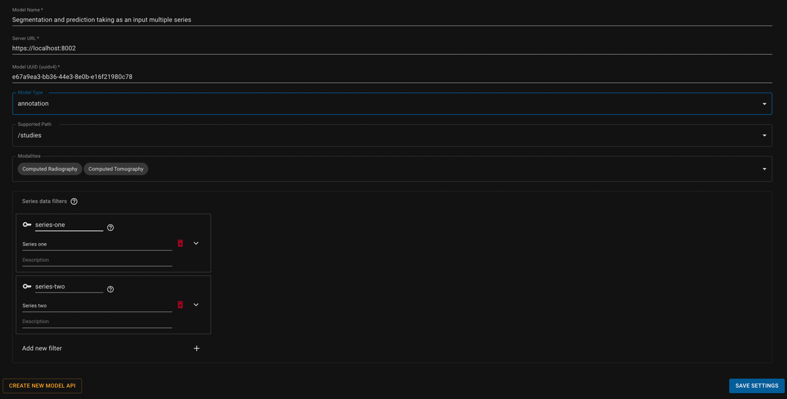

# Example-Model-API
In this repository we show how to design an API with an AI model and how to make it connected with the viewer. We return dummy annotations that should be taken as a starting point to plug in your own valid AI models and integrate seamlessly with the zhiva viewer. 

We show some example annotation types such as: 

- segmentation and prediction for a single series
- prediction for an entire study (multiple series) 
- segmentation and prediction taking as an input multiple series
- annotation and prediction taking as an input multiple series

We provide a separate endpoint for each approach. From there, you can easily start deploying the model. To learn more about the API structure, see [documentation](https://docs.zhiva.ai/latest)

Each endpoint must be configured in the `models.json` file in [model-proxy](https://github.com/zhiva-ai/model-proxy-example) and added manually to the viewer. To learn more see the [Model Configuration](#Model-configuration) section of this Readme. 


# How to run the API 

```
docker-compose up
```

API avalible at:

```
0.0.0.0:8011
```

# Model configuration
Follow the official [tutorial](https://docs.zhiva.ai/latest/managing-ai-models-inside-the-dicom-viewer). 
You need to configure a proxy server that will route requests from the [viewer](https://alpha.zhiva.ai/login) to the model API.

You will need to add each endpoint to `models.json` config file in [model-proxy](https://github.com/zhiva-ai/model-proxy-example)

Below is the configuration for both the viewer and the `model-proxy`. We assume that the API runs on `localhost:8011`
and is available on the same network as the `model-proxy`. This is the case if you follow the official documentation.

### Segmentation and prediction for a single series




```yaml
{
  "d4e548ad-f365-4c34-918b-4e61a8b896f0": {
    "uri": "http://localhost:8011/single-series-endpoint",
    "supports": ["/studies/series"],
    "task": "segmentation"
  }
}
```

### Prediction for an entire study (multiple series)



```yaml
{
  "3b7b2097-f158-404f-baa0-dc76a8d79ec0": {
    "uri": "http://localhost:8011/whole-study-endpoint",
    "task": "prediction",
    "supports": [
      "/studies"
    ]
  }
}
```

### Segmentation and prediction taking as an input multiple series



```yaml
{
  "7472e576-d49c-4fbf-9b2a-a52e1f59a906": {
    "uri": "http://localhost:8011/multiple-series-endpoint",
    "task": "segmentation",
    "supports": [
      "/studies"
    ],
    "dataFilter": [
      {
        "dataKey": "series-one",
        "title": "Series one"
      },
      {
        "dataKey": "series-two",
        "title": "Series two"
      }
    ]
  }
}
```

### Annotation and prediction taking as an input multiple series



```yaml
{
  "e67a9ea3-bb36-44e3-8e0b-e16f21980c78": {
    "uri": "http://localhost:8011/multiple-series-annotation-endpoint",
    "task": "annotation",
    "supports": [
      "/studies"
    ],
    "dataFilter": [
      {
        "dataKey": "series-one",
        "title": "Series one"
      },
      {
        "dataKey": "series-two",
        "title": "Series two"
      }
    ]
  }
}
```

# FAQ
- I'm getting an error on MacBook `docker rpc error code = unknown desc = executor failed running [...]`.

Your docker settings are limiting the size of the image and cannot install all the `requirements.txt`. Go to `Preferences > Resources > Advanced` in your `Docker Desktop` application and increase the memory limit.

